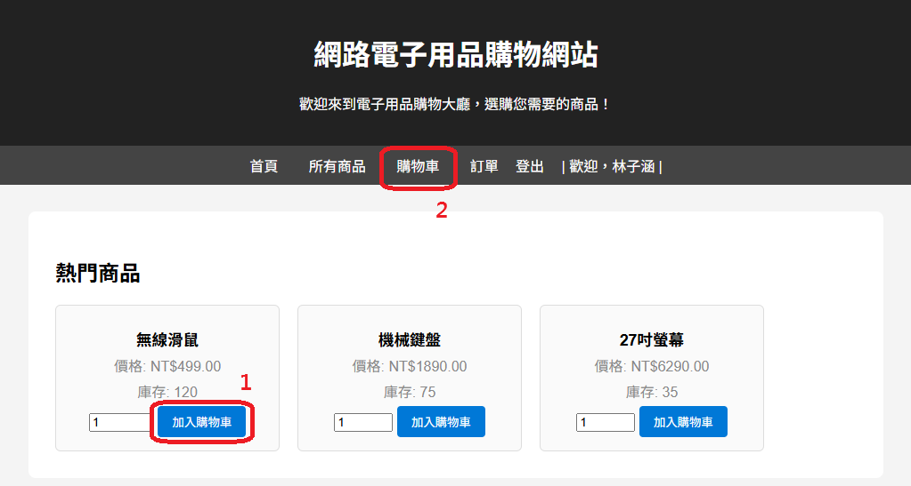
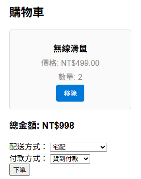
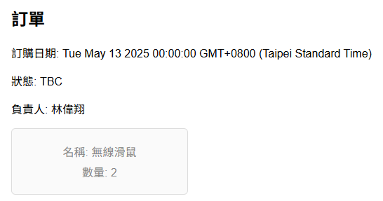

# Order







## 說明
下單後，資料庫產生共有四項資料表新增項目
- Order
    ```sql
    select * from `order` where customerNo=14; -- 14 是測試時產生的客戶編號
    ```
    ```
    MariaDB [order_practice]> select * from `order` where customerNo=14;
    +---------+------------+---------------+-------------+--------------+----------------+--------------+--------+------------+------------+
    | orderNo | orderDate  | billingStreet | billingCity | billingState | billingZipCode | promisedDate | status | customerNo | employeeNo |
    +---------+------------+---------------+-------------+--------------+----------------+--------------+--------+------------+------------+
    |       5 | 2025-05-13 | NULL          | NULL        | NULL         | NULL           | NULL         | TBC    |         14 |          3 |
    +---------+------------+---------------+-------------+--------------+----------------+--------------+--------+------------+------------+
    1 row in set (0.000 sec)
    ```

- OrderDetail  
    上方可看出客戶中只有一項訂單 (orderNo=5)
    ```sql
    select * from orderDetail where orderNo=5;
    ```
    ```
    MariaDB [order_practice]> select * from orderDetail where orderNo=5;
    +---------+-----------+-----------------+
    | orderNo | productNo | quantityOrdered |
    +---------+-----------+-----------------+
    |       5 |         1 |               2 |
    +---------+-----------+-----------------+
    1 row in set (0.001 sec)
    ```

- Shipment  
    ```sql
    select * from Shipment where orderNo=5;
    ```
    ```
    MariaDB [order_practice]> select * from Shipment where orderNo=5;
    +------------+----------+--------------+----------------+---------+-----------+------------+-----------+
    | shipmentNo | quantity | shipmentDate | completeStatus | orderNo | productNo | employeeNo | sMethodNo |
    +------------+----------+--------------+----------------+---------+-----------+------------+-----------+
    |          4 |        2 | 2025-05-13   | pending        |       5 |         1 |          4 |         1 |
    +------------+----------+--------------+----------------+---------+-----------+------------+-----------+
    1 row in set (0.001 sec)
    ```

- Invoice  
    ```sql
    select * from Invoice where orderNo=5;
    ```
    ```
    MariaDB [order_practice]> select * from Invoice where orderNo=5;
    +-----------+------------+----------+--------------+-------------+------------+---------+-----------+
    | invoiceNo | dateRaised | datePaid | creditCardNo | holdersName | expiryDate | orderNo | pMethodNo |
    +-----------+------------+----------+--------------+-------------+------------+---------+-----------+
    |         2 | 2025-05-13 | NULL     | NULL         | NULL        | NULL       |       5 |         3 |
    +-----------+------------+----------+--------------+-------------+------------+---------+-----------+
    1 row in set (0.000 sec)
    ```